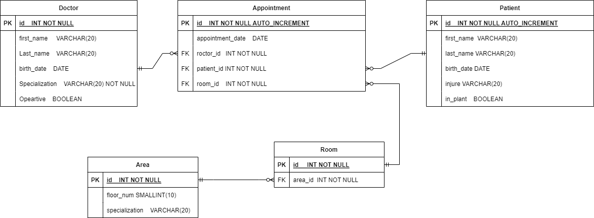
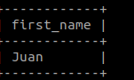

# Database Script

This is a repository to create an script that creates, modify and delete all the information present in a database from an hospital.

This is an assignment for class.

----

## Relational Diagram

First, we created a relational diagram which will be our model to create our database using MARIADB, that is a DataBaseManagmentSystem open source, based in relational databases.

We decided to create a database with 5 relations:

* Doctor
* Appointment
* Patient
* Room
* Area

----

## Creating a database

----

To start using MariaDB, we have to install MariaDB and run it.D

We have created a script that create the database, the tables and insert all the data [here](./scripts/start.sql). But we recommend you to follow this step-by-step so you can easily follow what is happening.

Then we will start using our SQL scripts [to create tables and database](./scripts/ddl.sql). Just copy and paste this script to start working with your own database.

This will show after you copy paste the script.

----

## Inserting data

----

Now that we have our database, just do the same we did with the previous script to [insert some data](./scripts/dml.sql) and start working with it.

----

## Querying

----

We have created some models of queries (link al scripts) we though it was interesting to think about, but are free to manipulate our database as you want

Finding the name of the doctor that has an appoitnment with the patient Cesar.

Finding the name of the doctor that has an appoitnment with the patient Juan.

----

## Updating

----

We also created a model to update the data and the relations, in case you think it is not correct and you want to make it look better.

You can modify it:

You can add data:

Or you can remove relation:

----

## Delete

----

Finally, after all your work is done, (do not forget to save your scripts in case you need this db in the future) we also made some scripts to delete all the date stored in, and make it like if never existed. We divided it in an specific order so everythin will work:

* [Destroy all data](./scripts/delete.sql)
* [Destroy all relations](./scripts/drop.sql)

It is important to execute the script in that orther, because the constraints at the database are set so we cannot remove information where it is being referenced for other table.

Other way, the data has to be inserted at the same orther, because we need the information of the referenced table to the referencing relations.

In case you want to make it at the same time, we also provided you the script to make it:

* [Destroy ALL!](./scripts/finish.sql) (WARNING, this script will erase all your database)

----

## Bonus exercises

----

Now that you have all the necessary to work with a database. We will propose to you to solve the following exercises. You have the solution and the display that we are looking for.

### Exercise 1

Find the doctor that has an appointment with the patient called "Cesar".

### Exercise 2

Find the name of the patient that is located in plant and has an appointment at room 2 cause of a broken leg.

### Exercise 3

Find the oldest patient that has an appointment with the doctor from the specialization "Emergency".

[solutions](./scripts/solutions.sql)
